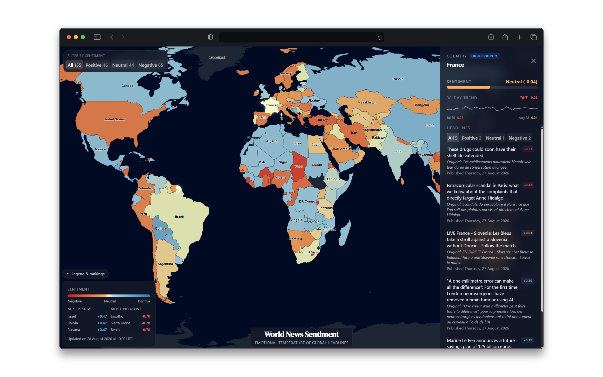
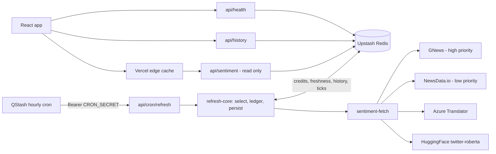
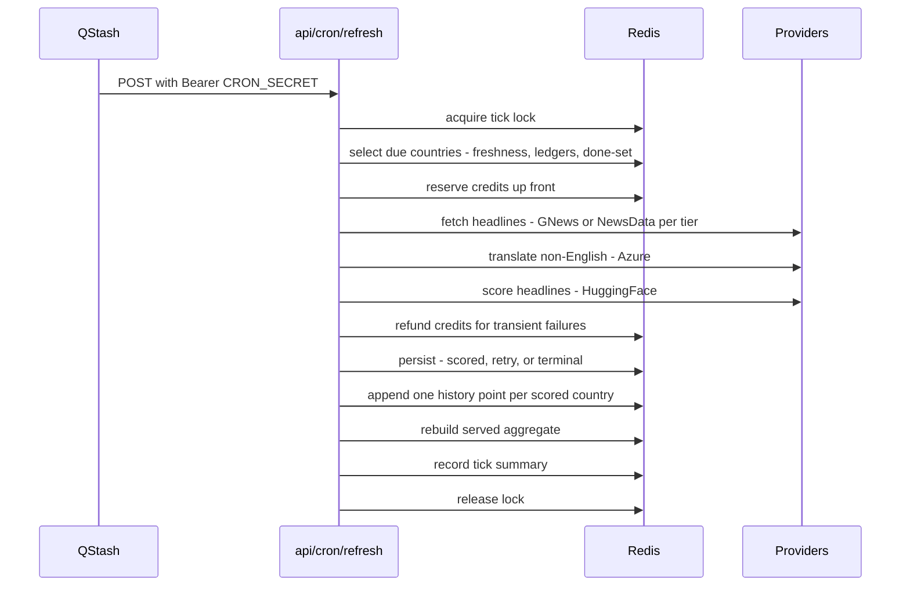

# World News Sentiment Map

[](https://github.com/sahmed0/news-sentiment-map/actions/workflows/ci.yml)

An interactive world map coloured by the sentiment of each country's latest news headlines,
refreshed hourly inside two free-tier news API quotas.

**[Live demo → news.sajidahmed.co.uk](https://news.sajidahmed.co.uk)**



## What it does

- Fetches the day's top headlines for **~155 countries** from two news providers, staying strictly
  inside both free-tier quotas via per-provider credit ledgers in Redis.
- **Translates** non-English headlines with Azure Translator and **scores** them with the
  `cardiffnlp/twitter-roberta-base-sentiment-latest` RoBERTa model.
- Serves an interactive map with per-country headlines and a 30-day sentiment history - refreshed
  hourly by a timezone-aware rolling scheduler, so every country is fetched near 6 am local time.

## Architecture

One writer, several readers. The hourly cron is the only process that spends API credits; every
browser request is served from Redis behind Vercel's edge cache.



A single tick: credits are reserved before they are spent, transient failures are refunded, and the
served aggregate is rebuilt from the durable per-country keys at the end.



## Design decisions

### Reserve-before-spend credit ledger

Free-tier quotas are unforgiving and a crashed tick must never leave spend unaccounted. Credits are
reserved in Redis *before* the fetches run, so a mid-tick failure can only over-count, never
under-count. Countries whose failure was transient get their credits refunded afterwards, reclaiming
the slack the daily limits were sized to provide. Each provider has its own ledger, so one API's
usage can never throttle the other.

### Three-way persistence taxonomy (scored / retry / terminal)

Not every failed fetch means the same thing. A country that produced a score is stored, freshened and
marked done. A country that had headline text but failed scoring, or hit a transient provider blip, is
left **entirely untouched** - not marked done, so the next tick retries it while its previous value
keeps serving. A terminal outcome (empty, unsupported, 4xx) is marked done *and* freshened, so a
quiet country waits out its cadence instead of burning budget daily.

### Timezone-aware rolling scheduler with staleness backfill

Refreshing ~155 countries at once would blow both quotas, and a country's news is most complete in its
own morning. Each tick picks the countries whose local time is ~6 am, then spends any leftover budget
on the stalest remaining countries - which is also how prior failures self-heal. Backfill will not pull
a country forward before its target hour unless it is already ~30 h overdue, so recovery never erodes
the schedule.

### Read/write separation + edge caching

The read path (`/api/sentiment`) never calls a news provider: it serves the pre-built aggregate, so
user traffic cannot spend credits no matter how much of it arrives. Responses carry
`s-maxage=300, stale-while-revalidate=3600`, so Vercel's edge absorbs the traffic and keeps serving
through a Redis outage. Per-country keys have no TTL, so the map degrades to last-good data rather
than to blank.

### Two-provider routing with a translation pivot

GNews ranks by popularity but covers ~71 countries; NewsData.io reaches ~155 but returns by recency.
High-priority countries are therefore fetched from GNews and the rest from NewsData, behind one
enriched shape. On the model side, only one sentiment model is deployed: every non-English headline is
pivoted through Azure Translator into English and scored there, which keeps one calibration to reason
about instead of many (previously a separate multilingual sentiment model was used for scoring 9 languages and others were translated to English and scored by the current model, but this meant scores were not comparable across the map.)

## Model evaluation

The production scoring path was measured against labelled news sentences rather than assumed to work:
**63.3% 3-class accuracy (macro-F1 0.627)** on 300 NewsMTSC sentences, and the translation round-trip
flips a headline's label on **8–15%** of items depending on language (worst: Japanese, 15.2%). The
model leans negative and is weakest on the neutral class; a threshold sweep confirms the shipped ±0.1
neutral band is near-optimal.

Full method, tables and limitations: [eval/RESULTS.md](eval/RESULTS.md).

## API

| Endpoint | Purpose | Caching / auth |
|---|---|---|
| `GET /api/sentiment` | World aggregate - one entry per country with its headlines | `s-maxage=300, stale-while-revalidate=3600`; `503` while warming |
| `GET /api/history?code=fr` | Last 30 daily scores for one country | `s-maxage=3600, stale-while-revalidate=86400`; `400` on unknown code |
| `GET /api/health` | Pipeline status, last tick, provider budgets, stale-country count | `s-maxage=60`; `503` when no recent tick |
| `POST /api/cron/refresh` | The rolling refresh tick - the only writer | QStash only; `Bearer CRON_SECRET`, timing-safe |

## Stack

| Layer | Choice |
|---|---|
| Frontend | React 19, TypeScript (strict), Vite, Tailwind CSS v4, framer-motion |
| Map | d3-geo + d3-zoom, topojson bundled from `world-atlas` (no CDN dependency) |
| Backend | Vercel serverless functions (TypeScript) |
| Storage | Upstash Redis |
| Scheduling | Upstash QStash (hourly cron) |
| Data | GNews, NewsData.io |
| ML | Azure Translator, HuggingFace `cardiffnlp/twitter-roberta-base-sentiment-latest` |
| Tooling | pnpm, vitest, ESLint, GitHub Actions |

## Local development

```powershell
pnpm install
pnpm dev          # frontend on http://localhost:5173
pnpm test         # vitest run
pnpm typecheck    # tsc --noEmit
pnpm lint
pnpm build        # production build (pnpm preview to serve it)
```

`pnpm dev` serves the frontend only - Vite does not run the `/api` routes, so the app shows its
warm-up/error path. Use `vercel dev` to exercise the API locally, and set `NEWSDATA_MAX_COUNTRIES=3`
first so a manual `POST /api/cron/refresh` only fetches a tiny subset instead of burning the daily
quota.

### Environment variables

| Variable | Used for |
|---|---|
| `KV_REST_API_URL`, `KV_REST_API_TOKEN` | Upstash Redis |
| `CRON_SECRET` | Bearer token the refresh tick requires |
| `NEWSDATA_API_KEY`, `GNEWS_API_KEY` | Headline providers |
| `AZURE_TRANSLATOR_KEY`, `AZURE_TRANSLATOR_REGION` | Translation (region only for regional resources) |
| `HUGGINGFACE_API_KEY` | Sentiment scoring |
| `NEWSDATA_MAX_COUNTRIES` | Optional: hard-cap countries per tick for local development |
| `DEBUG_PIPELINE` | Optional: verbose pipeline logging |

### Scheduling the tick

An Upstash QStash hourly schedule is the sole trigger (free tier - 500 messages/day). Create one
schedule (cron `0 * * * *`) targeting `https://<app>/api/cron/refresh`; QStash forwards the auth
header so the handler sees `Authorization: Bearer <CRON_SECRET>`.

```bash
curl -X POST https://qstash.upstash.io/v2/schedules/https://<app>/api/cron/refresh \
  -H "Authorization: Bearer $QSTASH_TOKEN" \
  -H "Upstash-Cron: 0 * * * *" \
  -H "Upstash-Forward-Authorization: Bearer $CRON_SECRET"
```

A missed or late fire self-heals: the country stays stale and not-done, so the next tick's backfill
picks it up. The ledger and per-day done-set make retried fires harmless.

## Testing & CI

Tests run on [vitest](https://vitest.dev) - node environment for `api/`, jsdom for components. The
backend is tested against an injected in-memory Redis fake (`test/helpers/fakeRedis.ts`) that mirrors
real key, zset and list semantics, so selection, ledger and persistence logic is covered without a
live database.

[GitHub Actions](https://github.com/sahmed0/news-sentiment-map/actions/workflows/ci.yml) runs lint,
typecheck, tests with v8 coverage, and the production build on every push and pull request. Coverage
thresholds are enforced in `vitest.config.ts` and a coverage table is written to the job summary.

## License

[MIT](LICENSE) © 2026 Sajid Ahmed.
